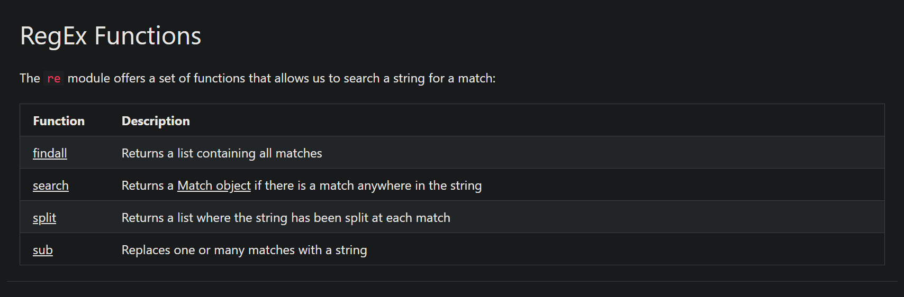
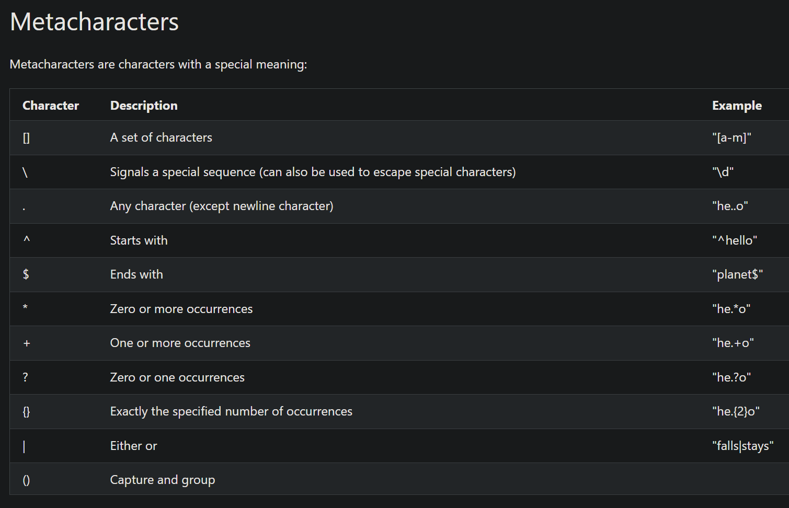
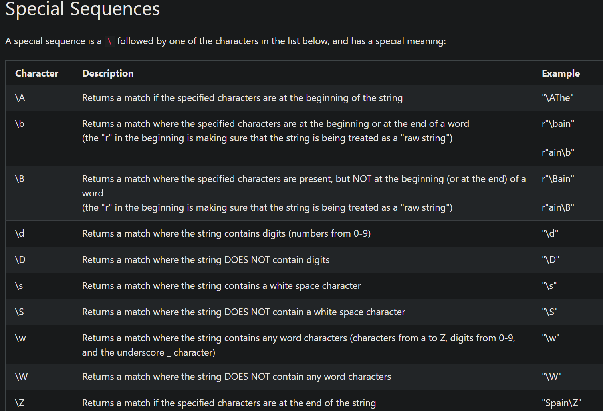
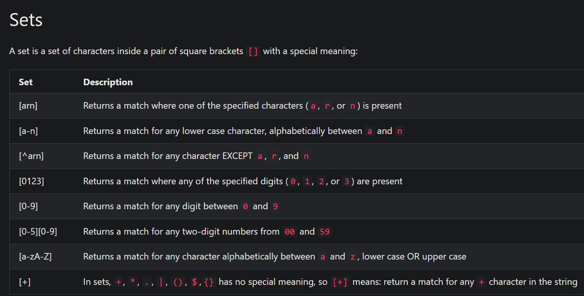

```python
def my_gen():
  try:
    yield 1
    yield 2
    yield 3
  finally:
    print("Generator closed")

gen = my_gen()
print(next(gen))
gen.close()
```
1. gen = my_gen(): Initializes the generator object but does not run any code inside it yet.
2. print(next(gen)): Starts the generator. The code executes until it hits yield 1, outputs 1 to the console, and pauses.
3. gen.close(): Manually shuts down the generator. This injects an exit signal into the paused generator, forcing it to exit the try block immediately.
4. "finally:"  Because the try block was forcefully exited by .close(), the finally block guarantees cleanup execution, printing "Generator closed".


The lines yield 2 and yield 3 are never reached because the generator is permanently closed after the first yield.


<h2>REGEX and its usecases





